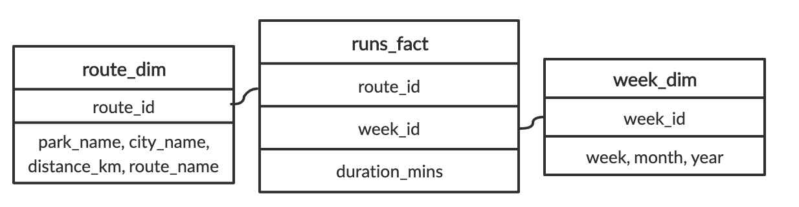
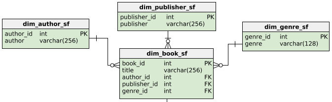
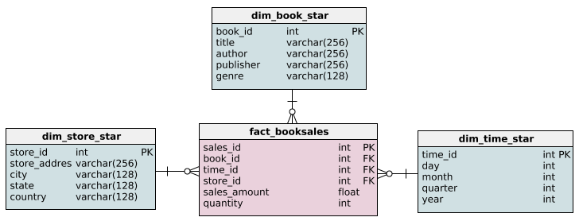
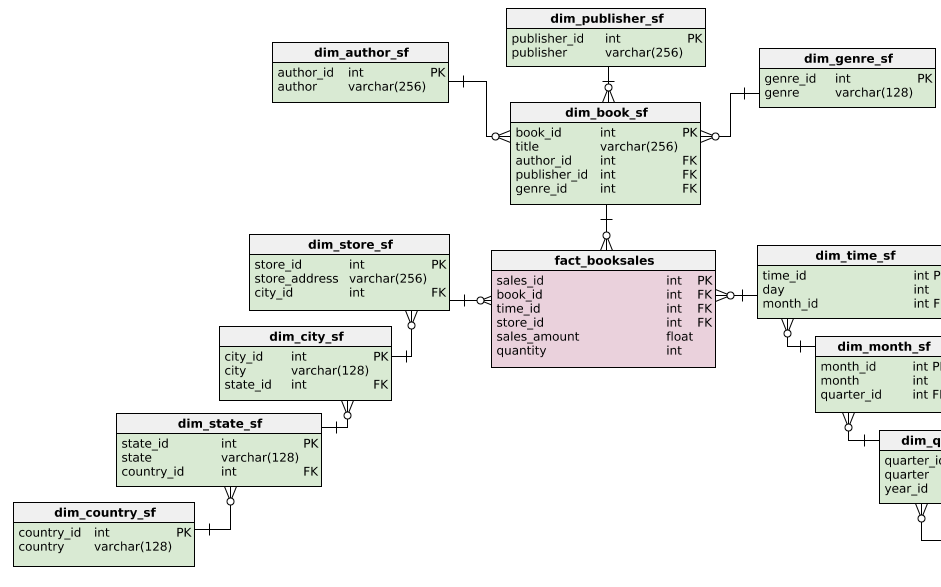

Deciding fact and dimension tables
Imagine that you love running and data. It's only natural that you begin collecting data on your weekly running routine. You're most concerned with tracking how long you are running each week. You also record the route and the distances of your runs. You gather this data and put it into one table called Runs with the following schema:

runs
duration_mins - float
week - int
month - varchar(160)
year - int
park_name - varchar(160)
city_name - varchar(160)
distance_km - float
route_name - varchar(160)
After learning about dimensional modeling, you decide to restructure the schema for the database. Runs has been pre-loaded for you.

Instructions 1/2
Question
Out of these possible answers, what would be the best way to organize the fact table and dimensional tables?

Possible answers

ANSWER.1
1.A fact table holding duration_mins, distance_km and foreign keys to dimension tables holding route details and week details, respectively.

2.A fact table holding week,month, year and foreign keys to dimension tables holding route details and duration details, respectively.

3.A fact table holding route_name,park_name,city_name, and foreign keys to dimension tables holding week details and duration details, respectively.

--Create a dimension table called route that will hold the route information.
--Create a dimension table called week that will hold the week information.
-- Create a route dimension table
CREATE TABLE route(
	route_id INTEGER PRIMARY KEY,
    route_name VARCHAR(160) NOT NULL,
    park_name VARCHAR(160) NOT NULL,
    distance_km INTEGER NOT NULL,
    city_name VARCHAR(160) NOT NULL
);
-- Create a week dimension table
CREATE TABLE route(
	week_id INTEGER PRIMARY KEY,
    week INTEGER NOT NULL,
    month VARCHAR(160) NOT NULL,
    year INTEGER NOT NULL
);

============
Querying the dimensional model
Here it is! The schema reorganized using the dimensional model:

Let's try to run a query based on this schema. How about we try to find the number of minutes we ran in July, 2019? We'll break this up in two steps. First, we'll get the total number of minutes recorded in the database. Second, we'll narrow down that query to week_id's from July, 2019.

--Calculate the sum of the duration_mins column.

SELECT
	-- Select the sum of the duration of all runs
	SUM(duration_mins)
FROM
	runs_fact;

--Join week_dim and runs_fact.
--Get all the week_id's from July, 2019.
SELECT
	-- Get the total duration of all runs
	SUM(duration_mins)
FROM
	runs_fact
-- Get all the week_id's that are from July, 2019
INNER JOIN week_dim ON  runs_fact.week_id =week_dim.week_id
WHERE month = 'July' and year = '2019';

===========
Adding foreign keys
Foreign key references are essential to both the snowflake and star schema. When creating either of these schemas, correctly setting up the foreign keys is vital because they connect dimensions to the fact table. They also enforce a one-to-many relationship, because unless otherwise specified, a foreign key can appear more than once in a table and primary key can appear only once.

The fact_booksales table has three foreign keys: book_id, time_id, and store_id. In this exercise, the four tables that make up the star schema below have been loaded. However, the foreign keys still need to be added.

Instructions
In the constraint called sales_book, set book_id as a foreign key.
In the constraint called sales_time, set time_id as a foreign key.
In the constraint called sales_store, set store_id as a foreign key.
-- Add the book_id foreign key
ALTER TABLE fact_booksales ADD CONSTRAINT sales_book
    FOREIGN KEY (book_id) REFERENCES dim_book_star (book_id);

-- Add the time_id foreign key
ALTER TABLE fact_booksales ADD CONSTRAINT sales_time
    FOREIGN KEY (time_id) REFERENCES dim_time_star (time_id);

-- Add the store_id foreign key
ALTER TABLE fact_booksales ADD CONSTRAINT sales_store
    FOREIGN KEY (store_id) REFERENCES dim_store_star (store_id)
=================
Extending the book dimension
In the video, we saw how the book dimension differed between the star and snowflake schema. The star schema's dimension table for books, dim_book_star, has been loaded and below is the snowflake schema of the book dimension.
Extending the book dimension
In the video, we saw how the book dimension differed between the star and snowflake schema. The star schema's dimension table for books, dim_book_star, has been loaded and below is the snowflake schema of the book dimension.

In this exercise, you are going to extend the star schema to meet part of the snowflake schema's criteria. Specifically, you will create dim_author from the data provided in dim_book_star.
In this exercise, you are going to extend the star schema to meet part of the snowflake schema's criteria. Specifically, you will create dim_author from the data provided in dim_book_star.
--Instructions 1/2
--Create dim_author with a column for author.
--Insert all the distinct authors from dim_book_star into dim_author.
-- Create dim_author with an author column
-- Create dim_author with an author column
CREATE TABLE dim_author (
    author VARCHAR(256)  NOT NULL
);

-- Insert distinct authors
INSERT INTO dim_author(author)
SELECT DISTINCT author
FROM dim_book_star;

--Alter dim_author to have a primary key called author_id.
--Output all the columns of dim_author.
-- Add a primary key
ALTER TABLE dim_author ADD COLUMN author_id SERIAL PRIMARY KEY;

-- Output the new table
SELECT * FROM dim_author;
======================
Querying the star schema
The novel genre hasn't been selling as well as your company predicted. To help remedy this, you've been tasked to run some analytics on the novel genre to find which areas the Sales team should target. To begin, you want to look at the total amount of sales made in each state from books in the novel genre.
Luckily, you've just finished setting up a data warehouse with the following star schema:
The tables from this schema have been loaded. Note that you should not use aliases in FROM and JOIN statements.

Instructions

Select state from the appropriate table and the total sales_amount.
Complete the JOIN on book_id.
Complete the JOIN to connect the dim_store_star table
Conditionally select for books with the genre novel.
Group the results by state.
==========================
-- Output each state and their total sales_amount
SELECT dim_store_star.state, SUM(fact_booksales.sales_amount)
FROM fact_booksales
	-- Join to get book information
    JOIN dim_book_star ON fact_booksales.book_id = dim_book_star.book_id
	-- Join to get store information
    JOIN dim_store_star ON fact_booksales.store_id = dim_store_star.store_id
-- Get all books with in the novel genre
WHERE
    dim_book_star.genre = 'novel'
-- Group results by state
GROUP BY
    dim_store_star.state;
====================

Querying the snowflake schema
Imagine that you didn't have the data warehouse set up. Instead, you'll have to run this query on the company's operational database, which means you'll have to rewrite the previous query with the following snowflake schema:

The tables in this schema have been loaded. Remember, our goal is to find the amount of money made from the novel genre in each state.

Instructions

Select state from the appropriate table and the total sales_amount.
Complete the two JOINS to get the genre_id's.
Complete the three JOINS to get the state_id's.
Conditionally select for books with the genre novel.
Group the results by state.
-- Output each state and their total sales_amount
SELECT dim_state_sf.state , SUM(fact_booksales.sales_amount)
FROM fact_booksales
    -- Joins for genre
    JOIN dim_book_sf on fact_booksales.book_id  = dim_book_sf.book_id
    JOIN dim_genre_sf on dim_book_sf.genre_id   =dim_genre_sf.genre_id
    -- Joins for state
    JOIN  dim_store_sf on dim_store_sf.store_id = fact_booksales.store_id
    JOIN  dim_city_sf on dim_city_sf.city_id = dim_store_sf.city_id
    JOIN  dim_state_sf on dim_state_sf.state_id = dim_city_sf.state_id
-- Get all books with in the novel genre and group the results by state
WHERE
    dim_genre_sf.genre = 'novel'
GROUP BY
    dim_state_sf.state ;
====================
Updating countries
Going through the company data, you notice there are some inconsistencies in the store addresses. These probably occurred during data entry, where people fill in fields using different naming conventions. This can be especially seen in the country field, and you decide that countries should be represented by their abbreviations. The only countries in the database are Canada and the United States, which should be represented as USA and CA.

In this exercise, you will compare the records that need to be updated in order to do this task on the star and snowflake schema. dim_store_star and dim_country_sf have been loaded.

Instructions

Output all the records that need to be updated in the star schema so that countries are represented by their abbreviations.
-- Output records that need to be updated in the star schema
SELECT * FROM dim_store_star
WHERE country != 'USA' AND country !='CA';
=========
Exercise
Extending the snowflake schema
The company is thinking about extending their business beyond bookstores in Canada and the US. Particularly, they want to expand to a new continent. In preparation, you decide a continent field is needed when storing the addresses of stores.

Luckily, you have a snowflake schema in this scenario. As we discussed in the video, the snowflake schema is typically faster to extend while ensuring data consistency. Along with dim_country_sf, a table called dim_continent_sf has been loaded. It contains the only continent currently needed, North America, and a primary key. In this exercise, you'll need to extend dim_country_sf to reference dim_continent_sf.

Instructions

--Add a continent_id column to dim_country_sf with a default value of 1. Note thatNOT NULL DEFAULT(1) constrains a value from being null and defaults its value to 1.
--Make that new column a foreign key reference to dim_continent_sf's continent_id.
-- Add a continent_id column with default value of 1
ALTER TABLE dim_country_sf
ADD COLUMN continent_id int NOT NULL DEFAULT(1);

-- Add the foreign key constraint
ALTER TABLE dim_country_sf ADD CONSTRAINT country_continent
   FOREIGN KEY (continent_id) REFERENCES dim_continent_sf(continent_id);

-- Output updated table
SELECT * FROM dim_country_sf;

================Converting to 1NF===========
In the next three exercises, you'll be working through different tables belonging to a car rental company. Your job is to explore different schemas and gradually increase the normalization of these schemas through the different normal forms. At this stage, we're not worried about relocating the data, but rearranging the tables.

A table called customers has been loaded, which holds information about customers and the cars they have rented.
cars_rented holds one or more car_ids and invoice_id holds multiple values. Create a new table to hold individual car_ids and invoice_ids of the customer_ids who've rented those cars.
Drop two columns from customers table to satisfy 1NF

-- Create a new table to hold the cars rented by customers
CREATE TABLE cust_rentals (
  customer_id INT NOT NULL,
  car_id VARCHAR(128) NULL,
  invoice_id VARCHAR(128) NULL
);

-- Drop two columns from customers table to satisfy 1NF
ALTER TABLE customers
DROP COLUMN cars_rented,
DROP COLUMN Invoice_id;
===================Converting to 2NF==================
Let's try normalizing a bit more. In the last exercise, you created a table holding customer_ids and car_ids. This has been expanded upon and the resulting table, customer_rentals, has been loaded for you. Since you've got 1NF down, it's time for 2NF.

Create a new table for the non-key columns that were conflicting with 2NF criteria.
Drop those non-key columns from customer_rentals.
-- Create a new table to satisfy 2NF
CREATE TABLE cars (
  car_id VARCHAR(256) NULL,
  model VARCHAR(128),
  manufacturer VARCHAR(128),
  type_car VARCHAR(128),
  condition VARCHAR(128),
  color VARCHAR(128)
);

-- Insert data into the new table
INSERT INTO cars
SELECT DISTINCT
  car_id,
  model,
  manufacturer,
  type_car,
  condition,
  color
FROM customer_rentals;

-- Drop columns in customer_rentals to satisfy 2NF
ALTER TABLE customer_rentals
DROP COLUMN model,
DROP COLUMN manufacturer,
DROP COLUMN type_car,
DROP COLUMN condition,
DROP COLUMN color;
============Converting to 3NF===========
Last, but not least, we are at 3NF. In the last exercise, you created a table holding car_idss and car attributes. This has been expanded upon. For example, car_id is now a primary key. The resulting table, rental_cars, has been loaded for you.
Instructions
Create a new table for the non-key columns that were conflicting with 3NF criteria.
Drop those non-key columns from rental_cars.
-- Create a new table to satisfy 3NF

-- Create a new table to satisfy 3NF
CREATE TABLE car_model(
  model VARCHAR(128),
  manufacturer VARCHAR(128),
  type_car VARCHAR(128)
);

-- Drop columns in rental_cars to satisfy 3NF
ALTER TABLE rental_cars
DROP COLUMN manufacturer,
DROP COLUMN type_car;
