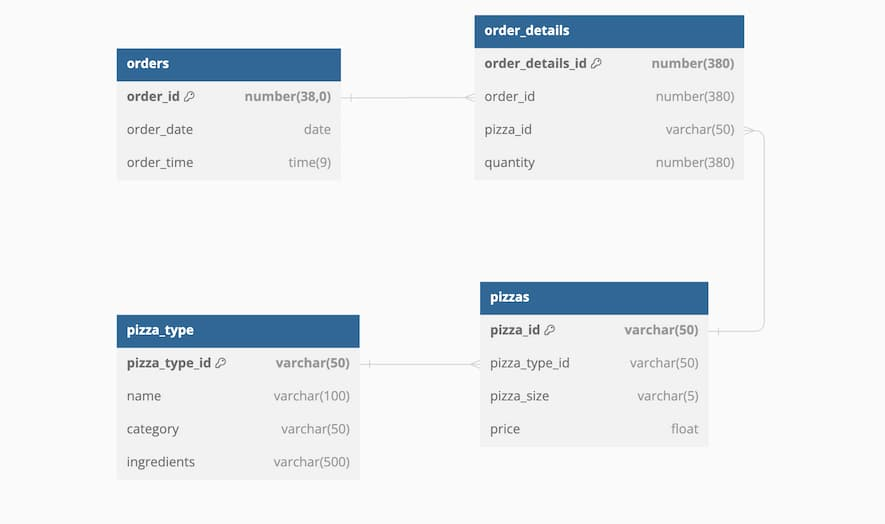

Introduction to Snowflake SQL:

Querying using Snowflake SQL
You are consulting as a Data Engineer at Pissa, an expanding pizza delivery company. Their database has four tables: pizzas, pizza_types, orders, and order_details. You can view each table from the SQL console:

SQL console

As part of their transition from PostgreSQL to Snowflake, you're now examining the different columns in the pizzas table. Are you ready to refresh your SQL skills?

Instructions
=--Select pizza_type_id, pizza_size, and price from the pizzas table.
-- Select pizza_type_id, pizza_size, and price from pizzas table
SELECT pizza_type_id,
    pizza_size,
    price
FROM pizzas;

-----Filtering in Snowflake SQL
As part of Pissa's migration from PostgreSQL to Snowflake, ensuring data integrity and correctness of the data after migration is crucial.

You're specifically working with the pizza_type table, which contains the following columns: pizza_type_id, name, category, and ingredients.

Let's apply your SQL skills to Snowflake!

Instructions 1/2
-Count the total number of rows in the pizza_type table.
Select COUNT(*) AS total_rows
FROM pizza_type;
--Filter the query to count only the pizzas categorized as 'Classic'.

---Checking data types
As a Data Engineer, it is important to understand how and where your data is stored so that you can optimize for cost, speed, and accuracy.

You are still familiarizing with the data at Pissa, so you decide to get storage information about the columns in one of their tables.

Instructions
-- Get information about the orders table
DESC TABLE orders;

--
Data type conversion
When working with databases, there are times when you need to change the data type of a column to better suit your operations or analyses.

Continuing your Data Engineer role at Pissa, you will practice converting data between types.

Instructions
--Select and convert the order_id column from the orders table to VARCHAR using CAST(), aliasing it to order_id_string.
-- Convert order_id to VARCHAR aliasing to order_id_string
SELECT CAST(order_id AS VARCHAR) AS order_id_string
FROM orders;

--Select the price column from the pizzas table, converting it (using the double colon operators) to NUMBER data type and aliasing as price_dollars
SELECT price,
-- Convert price to NUMBER data type
CAST (price AS NUMBER) AS price_dollars
FROM pizzas;

--
String functions
Having recently mastered some Snowflake SQL string functions, you're ready to put them into practice using Pissa's database!

Instructions 1/2
-- Capitalize each word in pizza_type_id
SELECT INITCAP(pizza_type_id) AS capitalized_pizza_id
FROM pizza_type;

--Use an appropriate function to combine the name and category columns.
-- Combine the name and category columns
SELECT CONCAT(name, ' - ', category) AS name_and_category
FROM pizza_type;

--DATE & TIME
As a Data Engineer at Pissa, you are now focusing on timestamp-related columns in their raw pizzas data.

Use your knowledge of date and time functions to accomplish the tasks.

Instructions 1/2
--Select the current date and current time using valid date and time functions.
SELECT CURRENT_DATE() AS current_date,
    CURRENT_TIME() AS current_time;

--Count the number of records.
--Extract the day of the week from order_date, aliasing as order_day.
-- Count the number of orders per day
SELECT COUNT(*) AS orders_per_day,
-- Extract the day of the week and alias to order_day
	EXTRACT(WEEKDAY FROM order_date) AS order_day
FROM orders
GROUP BY order_day
ORDER BY orders_per_day DESC

Functions & Grouping
You're examining pizza order details at Pissa. The team is interested in investigating revenue generated by different pizza sizes per month.

Complete the query using your knowledge of aggregate functions, sorting, and grouping to support the team with their analysis.

Instructions
Get the month from the order_date column.
Use appropriate Snowflake SQL keywords to group the query results.
Arrange your results by revenue in descending sequence.
-- Get the month from order_date
SELECT EXTRACT(MONTH FROM order_date) AS order_month,
    p.pizza_size,
    -- Calculate revenue
    SUM(p.price * od.quantity) AS revenue
FROM orders o
INNER JOIN order_details od USING(order_id)
INNER JOIN pizzas p USING(pizza_id)
-- Appropriately group the query
GROUP BY ALL
-- Sort by revenue in descending order
ORDER BY revenue DESC;

=================
NATURAL JOIN
Pissa, the ever-expanding pizza delivery enterprise, has a new challenge for you. They're interested in discovering which type of pizza generates the most revenue.

Here is the pizza schema for reference:

Schema Diagram

Identify the single top-selling pizza category using your knowledge of NATURAL JOIN.

Instructions

Get the category from the appropriate table.
NATURAL JOIN the pizza_type table.
Group the records by category from the pt (pizza_type) table.
Order the details by total_revenue in descending order and limit to a single record, so that only the top revenue-generating pizza is returned.
---
SELECT
	-- Get the pizza category
    pt.category,
    SUM(p.price * od.quantity) AS total_revenue
FROM order_details AS od
NATURAL JOIN pizzas AS p
-- NATURAL JOIN the pizza_type table
NATURAL JOIN pizza_type AS pt
-- GROUP the records by category
GROUP BY pt.category
-- ORDER by total_revenue and limit the records
ORDER BY total_revenue DESC
LIMIT 1;
-------------
The world of JOINS
Previously, you generated insights for Pissa around their sales and revenue by month. Now, you'll look into their most popular pizzas.

Apply your knowledge of joins to get the desired result.

Instructions 1/2
--1)Calculate the total revenue using the price column from the pizzas table and the quantity column of the order_details table, respectively.
Use an appropriate JOIN to include all records from the pizzas table.
SELECT COUNT(o.order_id) AS total_orders,
        AVG(p.price) AS average_price,
        -- Calculate total revenue
        SUM(p.price * od.quantity) AS total_revenue
FROM orders AS o
LEFT JOIN order_details AS od
ON o.order_id = od.order_id
-- Use an appropriate JOIN with the pizzas table
LEFT JOIN pizzas AS p
ON od.pizza_id = p.pizza_id

--SELECT COUNT(o.order_id) AS total_orders,
        AVG(p.price) AS average_price,
        -- Calculate total revenue
        SUM(p.price * od.quantity) AS total_revenue
FROM orders AS o
LEFT JOIN order_details AS od
ON o.order_id = od.order_id
-- Use an appropriate JOIN with the pizzas table
LEFT JOIN pizzas AS p
ON od.pizza_id = p.pizza_id;

--2)Select pizza name from pizza_type.
Perform a NATURAL JOIN with the pizza_type table.

SELECT COUNT(o.order_id) AS total_orders,
        AVG(p.price) AS average_price,
        -- Calculate total revenue
        SUM(p.price * od.quantity) AS total_revenue,
        -- Get the name from the pizza_type table
		pt.name AS pizza_name
FROM orders AS o
LEFT JOIN order_details AS od
ON o.order_id = od.order_id
-- Use an appropriate JOIN with the pizzas table
RIGHT JOIN pizzas p
ON od.pizza_id = p.pizza_id
-- NATURAL JOIN the pizza_type table
NATURAL JOIN pizza_type AS pt
GROUP BY pt.name, pt.category
ORDER BY total_revenue desc, total_orders desc;
--------------------
Exercise
Subqueries
Pissa, the expanding pizza delivery enterprise, is now using your expertise to identify some trends.

They want to streamline its pizza offerings by identifying under-performing pizzas. Your task is to find the pizza types ordered less frequently than the average for all types.

Instructions
--Fill in the subquery to find the AVG of total_quantity.
Calculate total_quantity within the subquery.
Alias the subquery as subquery
SELECT pt.name,
    pt.category,
    SUM(od.quantity) AS total_orders
FROM pizza_type pt
JOIN pizzas p
    ON pt.pizza_type_id = p.pizza_type_id
JOIN order_details od
    ON p.pizza_id = od.pizza_id
GROUP BY ALL
HAVING SUM(od.quantity) < (
  -- Calculate AVG of total_quantity
  SELECT AVG(total_quantity)
  FROM (
    -- Calculate total_quantity
    SELECT SUM(od.quantity) AS total_quantity
    FROM pizzas p
    JOIN order_details od
    	ON p.pizza_id = od.pizza_id
    GROUP BY p.pizza_id
    -- Alias as subquery
  ) AS subquery
);
==================
Common Table Expressions
Pissa, the company you're consulting for, is planning a promotional campaign and needs your expertise.
The campaign aims to spotlight their most popular pizza based on total orders.
They're also considering introducing a value meal featuring their least expensive pizza.
Your task as a consulting data engineer is to identify both these pizzas.
--
Instructions
Create a CTE named most_ordered and limit the results to 1.
Create another CTE, called cheapest_pizza and filter for the cheapest pizza using a subquery to find the minimum price.
Complete the query to select pizza_id and total_qty aliased as metric from most_ordered CTE.
Include pizza_id and price aliased as metric from cheapest_pizza CTE. Note, maintain the order of the columns.

-- Create a CTE named most_ordered and limit the results
WITH most_ordered AS (
    SELECT pizza_id, SUM(quantity) AS total_qty
    FROM order_details GROUP BY pizza_id ORDER BY total_qty DESC
    LIMIT 1
)
-- Create CTE cheapest_pizza where price is equal to min price from pizzas table
, cheapest_pizza AS (
    SELECT pizza_id, price
    FROM pizzas
    WHERE price = (SELECT MIN(price) FROM pizzas)
    LIMIT 1
)

SELECT pizza_id, 'Most Ordered' AS Description, total_qty AS metric
-- Select from the most_ordered CTE
FROM most_ordered
UNION ALL
SELECT pizza_id, 'Cheapest' AS Description, price AS metric
-- Select from the cheapest_pizza CTE
FROM cheapest_pizza;
----
Exercise
Early filtering
Pissa has now asked for your expertise to optimize the performance of their database queries. They suspect that their existing queries are not efficient enough and take too long to run.

The goal is to retrieve the orders made after November 01, 2015, and only the pizzas in the 'Veggie' category.
Complete the given SQL query by implementing early filtering techniques.

Instructions
Complete the filtered_orders CTE, filtering only to include orders made after 2015-11-01.
Complete the filtered_pizza_type CTE, filtering only to include pizzas in the 'Veggie' category.
Retrieve the records from the filtered_orders CTE.
Join the filtered_pizza_type CTE based on the pizza_type_id column using ON clause.

WITH filtered_orders AS (
  SELECT order_id, order_date
  FROM orders
  -- Filter records where order_date is greater than November 1, 2015
  WHERE order_date > '2015-11-01'
)

, filtered_pizza_type AS (
  SELECT name, pizza_type_id
  FROM pizza_type
  -- Filter the pizzas which are in the Veggie category
  WHERE category = 'Veggie'
)

SELECT fo.order_id, fo.order_date, fpt.name, od.quantity
-- Get the details from filtered_orders CTE
FROM filtered_orders AS fo
JOIN order_details AS od ON fo.order_id = od.order_id
JOIN pizzas AS p ON od.pizza_id = p.pizza_id
-- JOIN the filtered_pizza_type CTE on pizza_type_id
JOIN filtered_pizza_type AS fpt ON p.pizza_type_id = fpt.pizza_type_id
============
Exercise
Querying JSON data
Yelpto, a leading platform for discovering local businesses, seeks your expertise as a consulting Data Engineer.

They aim to explore the restaurant industry, focusing on popular 5-star-rated restaurants that are open on weekends in Philadelphia.

You'll work with the yelp_business_data table, particularly the name, categories, attributes, and hours columns.

You can explore the yelp_business_data table in the SQL console.

SQL console

Note that the attributes and hours columns are VARIANT types.

Instructions
--Retrieve Saturday hours from the hours VARIANT column.
Retrieve Sunday hours from the hours VARIANT column.
Filter where categories include 'Restaurant'.

SELECT name,
    review_count,
    -- Retrieve the Saturday hours
    hours:Saturday,
    -- Retrieve the Sunday hours
    hours:Sunday
FROM yelp_business_data
-- Filter for Restaurants
WHERE categories LIKE '%Restaurant%'
    AND (hours:Saturday IS NOT NULL AND hours:Sunday IS NOT NULL)
    AND city = 'Philadelphia'
    AND stars = 5
ORDER BY review_count DESC;
-------------------
Exercise
JSONified
Semi-structured data can be challenging to query, so let's practice interacting with Yelpto's data once again.

Here, you will filter the contents of a VARIANT column.

Instructions
--Filter where the DogsAllowed key in the attributes column is 'True' (note this is a string, not boolean).
Filter where the BusinessAcceptsCreditCards key in the attributes column is 'True' (note this is a string, not boolean).

SELECT business_id, name
FROM yelp_business_data
WHERE categories ILIKE '%Restaurant%'
	-- Filter where DogsAllowed is '%True%'
	AND attributes:DogsAllowed ILIKE '%True%'
    -- Filter where BusinessAcceptsCreditCards is '%True%'
    AND attributes:BusinessAcceptsCreditCards ILIKE '%True%'
    AND city ILIKE '%Philadelphia%'
    AND stars = 5
